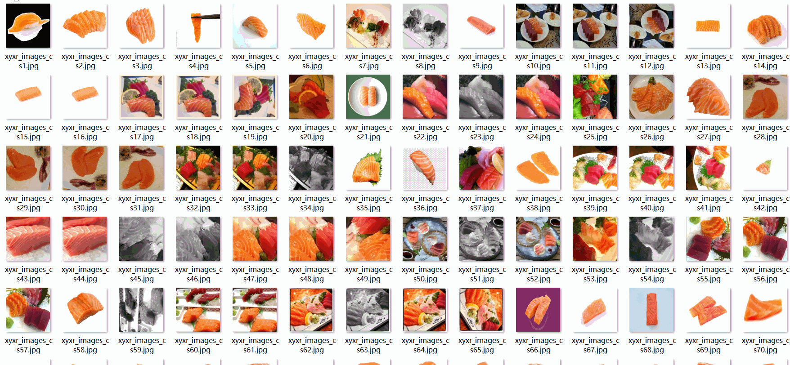
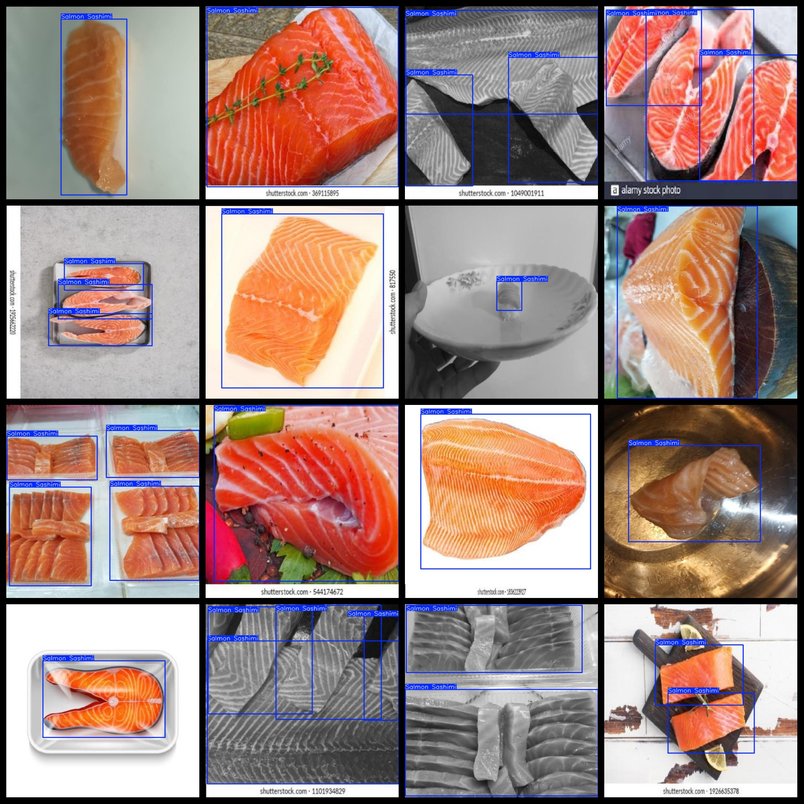

# Food Sashimi Dataset 2282 imagesVOC+YOLO format

The dataset of raw sashimi food images is 2282, in VOC+YOLO format.

Dataset format: Pascal VOC format + YOLO format (the txt file does not contain the split path, it only contains jpg images and corresponding VOC format xml files and yolo format txt files)

Number of images (number of jpg files): 2282

Number of xml files: 2282

Number of txt files: 2282

Number of categories: 1

The Github repository is: datasets_sl

["Salmon Sashimi"]

Number of boxes labeled in each category:

Salmon Sashimi Frames = 4482

Total frames: 4482

Number of images per category:

Salmon Sashimi occupies 2282 pictures.

Image resolution: 640x640

Use the labeling tool: labelImg

Dataset Augmentation: Yes

Rules for annotation: Draw a rectangle around the category.

Important note: The dataset does not have been divided into training, validation, and testing sets.

Special Disclaimer: This dataset does not guarantee the accuracy of the trained models or weight files.

Dataset format: Pascal VOC format + YOLO format (the txt file does not contain the split path, it only contains jpg images and corresponding VOC format xml files and yolo format txt files)

Number of images (number of jpg files): 2282

Number of xml files: 2282

Number of txt files: 2282

Number of categories: 1

The Github repository is: datasets_sl

["Salmon Sashimi"]

Number of boxes labeled in each category:

Salmon Sashimi Frames = 4482

Total frames: 4482

Number of images per category:

Salmon Sashimi occupies 2282 pictures.

Image resolution: 640x640

Use the labeling tool: labelImg

Dataset Augmentation: Yes

Rules for annotation: Draw a rectangle around the category.

Important note: The dataset does not have been divided into training, validation, and testing sets.

Special Disclaimer: This dataset does not guarantee the accuracy of the trained models or weight files.

## Images

---

Here is a pay link on Stripe (https://buy.stripe.com/3cs8yP7sY87d0vu9AB). Please contact me lonlonago@foxmail.com after funding $89, and I will send you a complete data files, thank you!

